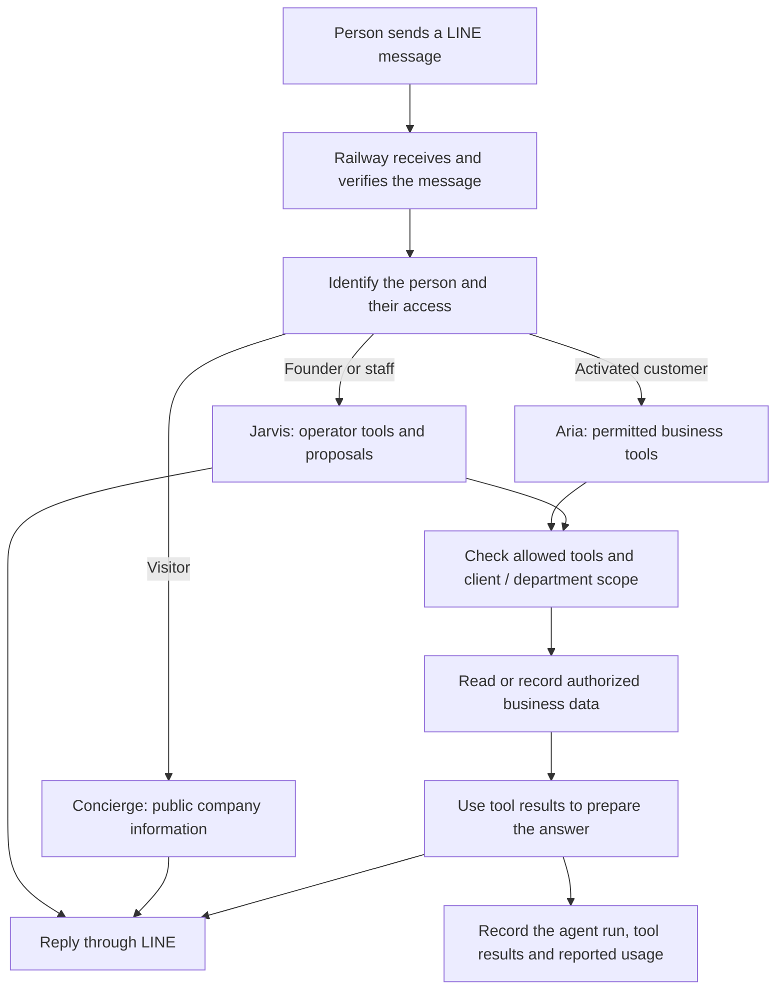

# Neurohands — AI agents for business

**Local agent lab:** run `npm run lab:studio`, select `neurohands_concierge`,
`neurohands_aria` or `neurohands_jarvis`, and open **Chat**. These roles use the
same local Qwen model with permitted tools for fictional company information,
orders, documents, calculation, local tasks, memory and team delegation.
Follow [the agent test guide](docs/LOCAL_AGENT_LAB.md) for examples and the
18-scenario before-and-after benchmark. `neurohands_chat` remains the plain-chat
baseline; `neurohands_test` remains the echo check. The [original setup guide](docs/LANGGRAPH_LOCAL_TEST.md)
explains installation and private settings. This lab is separate from production
LINE; Gemini takeover is not connected.

**Measured local result, 16 September 2026:** 17/36 task checks passed in plain
chat and 24/36 with tools. All 11 local tool/state workflows and 219 automated
tests passed at that measured revision. After incorporating the production
Gemini adapter repair, named-workflow runtime and gated resumable-uploader
checks, the local branch passed 275 automated tests on 17 September 2026; this
does not change the recorded model benchmark. The remaining model-answer failures are recorded in the
[benchmark report](docs/AGENT_BENCHMARK_RESULTS.md); the new local graphs are
experimental and are not deployed to LINE.

**Named-agent workflow laboratory, 17 September 2026:** the repository now has
fixed local workflows for one role (`individual`), two roles (`pair`) and five
roles (`full_department`). They use synthetic local data and approved local
tools only; they are not connected to production LINE, customer data, Railway,
Supabase or external connectors. The deterministic conformance run checks
workflow plumbing and safety controls such as fixed roles and handoffs, scoped
reads, tool allowlists, idempotency, terminal failures and evidence storage. It
does not measure model reasoning, answer quality or business correctness.

One real-model sample per topology used local Ollama with `qwen3:1.7b`. The
individual workflow passed its basic example. Initial pair and full-department
runs failed safely. After exact step-level tool scopes and one bounded empty
reply retry were added, the repeated pair run completed structurally but still
omitted the document's exact four-working-day lead time; the repeated five-role
run still failed after two empty final replies and blocked all downstream roles.
These small development samples are not a reliability estimate or capability
ranking. See the [named-agent workflow guide](docs/NAMED_AGENT_WORKFLOW.md),
[initial review](artifacts/benchmarks/2026-09-17-real-named-review.json), and
[post-guardrail review](artifacts/benchmarks/2026-09-17-real-named-review-after-guardrails.json).
No production connection or deployment is claimed.

The staged software-admission work is also not a production release. Its model
transport lifecycle is connected locally while `SOFTWARE_ADMISSION_ENABLED`
remains `false`; the machine-readable release pack currently records **4 of 12
controls passed and 8 partial**. Six controls have passing deterministic local
machine probes, but C03 and C04 remain partial because their production and
founder-acceptance requirements are incomplete. Run `npm run release:audit` to inspect
that evidence. `npm run release:gate` is expected to fail until all controls
have verified evidence and founder acceptance.

Neurohands aims to give a business an AI workforce that can answer questions, use approved business tools, work with company documents and report what it did. The owner decides each agent's responsibilities and access.

**Today, this is a v3.10 pilot for KNC Glass.** The LINE gateway, customer agent, owner console and document portal are implemented and deployed. The next milestone is proving a complete customer conversation about a real uploaded document. The larger team and department platform is still under development.

## Who does what?

| Role | Who uses it? | What it does in the current pilot |
| --- | --- | --- |
| **Jarvis — owner/operator assistant** | The founder and authorized staff | Shows business summaries, agent runs and errors; issues customer activation codes and upload links; inspects documents; handles explicit operator commands and approved tool actions. |
| **Aria — customer business agent, AGT-001** | An activated customer | Uses permitted tools to look up products, orders and lead times; read that customer's available documents; record useful customer facts, support cases and follow-up tasks. |
| **Concierge — public receptionist** | A visitor who has not activated customer access | Explains the business using configured company information and guides visitors toward a demo or activation. It does not receive private customer tools. |

These are **three application roles using AI models**. We have not trained three new models. The roles can use the same AI engine while having different instructions, permissions and information. As of **16 September 2026**, the production route is configured for **Gemini / `gemini-3.6-flash`**. The owner confirmed that the existing Gemini key is valid and uses the Free Tier. After the adapter repair, six observed Gemini runs returned usable HTTP 200 responses and their LINE webhook handlers completed. This proves the repaired provider and delivery path can complete; it does not yet establish answer correctness, useful tool execution or repeated reliability. See the dated status below.

The first September 16 repair set `GEMINI_ENABLED=true` and cleared `FALLBACK_PROVIDER` and `FALLBACK_BASE_URL` to remove the broken fallback route, without changing existing secrets. After that deployment's math test failed, [PR #14](https://github.com/tanadanaitan-prog/neurohands-ai-agent/pull/14) corrected the Gemini request adapter and deployed as `a315fdd0cad03a5339abb87440c83061fc401dbe`. Its release version, readiness and later provider/delivery path checks pass. Neither repair deploys the local agent lab or connects automatic Ollama-to-Gemini takeover. OpenRouter remains a separate optional route requiring its own key and verified allowance.

The owner selected **Inkling Small (free)** as a third configuration for synthetic tests only. Its separate harness checks a fictional order and tool call. It never receives LINE conversations, KNC documents or memories. See [third-model setup](docs/PUBLIC_MODEL_TEST.md). A successful synthetic test will not replace the real Aria customer proof.

Jarvis currently provides an operator interface. Fixed one-, two- and five-role workflows are available only in the isolated local named-agent laboratory. Automatic delegation among independent agents, departments and managers in production is part of the future platform.

The **deployed Jarvis repair** adds conversational business tools, a short history of the operator's own delivered conversations, confirmed notes, and proposals that require approval. The September 16 live math test failed after the first configuration repair. A subsequent Gemini adapter repair passed automated checks, deployed successfully and has since completed six observed model-and-delivery runs. Their message bodies were not inspected, so answer quality remains a separate acceptance test. See [Jarvis pilot capabilities and acceptance](docs/JARVIS_PILOT.md).

## How a request moves through the system



For example, a customer asks about an order. The application identifies their account, Aria requests an allowed order lookup, and the server limits the lookup to the authorized account. Aria uses the returned information to answer. An operator can inspect the run and tool results afterward. If a required service fails, the system should report that failure; it must not treat a guessed answer as verified business data.

| Part of the system | Its job |
| --- | --- |
| **LINE Official Account** | The conversation customers and the owner see. |
| **LINE Developers console** | Connects that OA's Messaging API channel to the application's webhook and credentials. |
| **GitHub** | Stores the source code, documentation and change history. |
| **Railway** | Runs the application, receives LINE events and calls the connected services. |
| **Supabase** | Stores business records, customer access, private documents, saved facts and execution records. |
| **Selected AI provider** | Supplies AI responses and tool requests; the application enforces access. |

Connecting GitHub to Supabase alone does not connect LINE or configure Railway's runtime credentials. Each connection has its own purpose.

## Documents and customer activation

An **upload link** gives permission to submit a document. An **activation code** links a customer's LINE account to the correct company and department. They serve different purposes.

1. In the founder's LINE chat, send `code: KNC sales` to create a private customer activation code.
2. The customer uses their own LINE account on the same OA and sends `activate ` followed by the **complete private code beginning `NH-`**. A shortened code hint is not sufficient.
3. After successful activation, the customer sends `upload` to receive their secure link. The founder can also issue a link with `upload: KNC sales`.
4. Upload the file through that portal. The application stores the original privately and extracts supported content.
5. Ask Aria a question about the uploaded document. Aria must retrieve its content with an allowed document tool before answering from it.
6. The operator checks the answer against the original and inspects the corresponding run and successful document tool call.

The founder account routes to **Jarvis**, so use a second personal LINE account for the customer/Aria test. Aria is enabled through account activation; there is no separate Aria file to attach to LINE.

Word, Excel and CSV extraction are implemented. Partial extraction is labeled. PDF files are currently stored without text extraction. This version uses the secure portal; files attached directly in LINE are not ingested by the application. Uploading a document does not retrain the AI model.

The deployed portal remains limited to **10 MiB** per file. The connected
Supabase organization is on the Free plan, whose verified limit is **50 MB per
file and 1 GB total storage**. This branch contains a gated
**50,000,000-byte** TUS path designed to send fixed 6 MiB resumable chunks from
the browser directly to Supabase Storage while Railway authorizes the tenant,
creates the immutable path and verifies the completed object size. It is disabled by
default and has not been deployed or accepted with a real 50 MB upload. Local
tests with mocked Storage exercise the staged behavior; they do not prove live
transfer capacity. When enabled, the path is designed to retain files above
10 MiB as private originals, but those files are not automatically extracted
for an agent to read. See the
[large-file upload architecture](docs/LARGE_UPLOAD_ARCHITECTURE.md).

## Current status — 16 September 2026

This section supersedes older provider and deployment status statements. Historical checks remain dated below; they were not all repeated during the September 16 repairs. The [September 16 connectivity and repair record](artifacts/benchmarks/2026-09-16-line-connectivity.json) separates the initial diagnosis, first configuration repair, failed LINE test and subsequent code-repair deployment.

| Status | What the evidence establishes |
| --- | --- |
| **Gemini adapter and LINE delivery path working** | [PR #14](https://github.com/tanadanaitan-prog/neurohands-ai-agent/pull/14) deployed as `a315fdd0cad03a5339abb87440c83061fc401dbe`. It corrects the JSON schema field, represents tool results with the user role, preserves tool-call IDs and records safe error categories without private details. Its production suite passed **198 tests**, code checks and build; independent review found no blocking issue. Railway deployment `8cbb1ef5-6b15-4d79-87e3-98c239f42bd5` succeeded. Six later Gemini runs returned usable HTTP 200 responses and their webhook handlers completed. Across 16 provider attempts they reported 41,827 total tokens and 35,034 ms of provider request time. No message bodies were read, so correctness is still unverified. |
| **Configuration repaired; deployment verified September 16** | Railway deployment `3a9dabfb-c98e-49be-baf5-574ea8814389` succeeded with unchanged production `main` commit `0bc4b7b35707bd2c2bba16607e024287e8c597cb`. Gemini is enabled with model `gemini-3.6-flash`; fallback provider and base URL are empty. `/ready` returned HTTP 200 with `ready: true`, and `/version` matched that commit. These checks do not prove model generation. |
| **Historical release verification, September 9** | [PR #9](https://github.com/tanadanaitan-prog/neurohands-ai-agent/pull/9) released the provider-switch and Jarvis runtime as `16a0cbe`. That Railway build passed **157 tests**; its release version and readiness checks passed without inference requests. This is prior release evidence, not the current deployment identifier or a new test count. |
| **Historical recovery evidence, September 7–9** | The recovered Phase 1 database and private document bucket were configured. All 131 original database records were preserved and checked, and one pilot document was uploaded and parsed. Those detailed data-preservation and document checks were not rerun in the September 16 repair. |
| **LINE connectivity verified, limited scope** | The user confirmed that the founder's `help` command replies in LINE. September 16 webhook requests and handler completions were also observed. Before repair, the user-supplied `health` reply reported Gemini disabled or unconfigured and fallback paused for authentication rejection. These deterministic replies establish connectivity, not successful model generation. |
| **Implemented; full live proof pending** | Aria's document tools, activation, access checks, run traces and usage recording have automated tests. The full second-account customer activation → correct document answer → successful authorized trace remains unverified. |
| **Earlier live model test failed; later transport recovered** | After the first configuration repair, `what is 12+5=` received an unverified-request response and Gemini logged HTTP 400. After the code repair, later requests completed through Gemini and LINE. The logs support recovery of the request and delivery path but do not reveal those later answers, prove that `12+5` was answered correctly or complete the live Aria document proof. Automatic model failover is also still unverified. |
| **Historical OpenAI failures, September 9–10** | A September 9 authenticated model-list request returned HTTP 200, but a bounded `gpt-4.1-mini` generation test returned HTTP 429 `credit_balance_exhausted` after 1,742 ms. A September 10 log reported HTTP 401 `authentication_rejected`; the pre-repair LINE health reply confirmed the fallback was paused. These are historical failures of the previous route, not a new Gemini test. See [dated provider setup and allowance checks](docs/FREE_PROVIDER_SETUP.md). |
| **Planned / experimental** | The broader team website, automatic delegation, department workflows, recurring task execution, semantic document search and external connector framework are not established live capabilities. The experimental `/studio` website remains disabled for this milestone. |

The current repository and destination service are available, but the complete original-account migration and source deployment inventory remain unfinished. Preserve the original resources until that reconciliation is complete.

See the [current connection matrix](docs/APP_CONNECTION_MATRIX.md), [named-agent workflow laboratory](docs/NAMED_AGENT_WORKFLOW.md), [acceptance checklist](docs/GOAL_ACCEPTANCE.md), [dated live test evidence](docs/LIVE_STATUS.md), [Phase 1 recovery record](docs/PHASE1_STATUS.md) and [longer-term project plan](docs/PROJECT_PLAN.md).

The [Software Passport and admission-control record](docs/SOFTWARE_PASSPORTS.md)
defines how provider limits, private account uncertainty, permissions, data
conditions, and shared capacity are handled. The register is checked during the
build. The guarded OpenRouter and LangSmith test routes block new external
requests while their private allowances are unknown; they do not silently
disable the existing LINE service.

The development branch also stages a durable Supabase reservation migration,
a matching server-only adapter, and a production model-dispatch seam. They are
not active in the live service: `SOFTWARE_ADMISSION_ENABLED` remains `false`,
the migration has not been applied, and no account-specific allowance is
treated as known. Enabling the seam before its authority, audit, accepted
workflow and verified allowance inputs exist fails closed before a model call.

## How this can grow into an AI workforce

The following describes the **intended expansion** beyond the fixed local
one-, two- and five-role laboratory. It is not a claim that these workflows run
in production.

| Level | Example of the intended work | How it helps the business | What must be added or proven |
| --- | --- | --- | --- |
| **Individual agent** | Aria answers a customer's question from approved records and captures a follow-up. | Reduces repeated lookups and keeps a record of the answer and action. | Complete the current live pilot; measure answer quality, speed and usage. |
| **Team** | A sales agent gathers requirements, a document agent checks specifications and a planning agent prepares the next steps. | Divides a larger request into clear, coordinated jobs. | Assignment, handoffs, dependencies, shared evidence and a verified combined result. |
| **Department** | A sales department coordinates enquiries, quotations and follow-ups; an operations department tracks delivery exceptions. | Gives each department a consistent process, accountable work queue and performance view. | Department-specific tools and permissions, approvals, scheduling and realistic evaluation. |
| **Organization** | Jarvis gives the owner a view across departments, identifies blocked work and proposes priorities. | Connects customer requests to business-wide decisions while keeping the owner in control. | Cross-department coordination, resource and budget limits, connector monitoring and measured organization-level outcomes. |

An engineering team is also part of the goal: turn an approved request into requirements, a design, implementation, tests and a reviewed release for websites, software or integrations. Hardware designs and simulations would require separate physical verification. These are future capabilities, not work completed by the current LINE pilot.

The intended full process is: **understand the request → define success → check access and evidence → plan and assign → execute → verify → report → record and improve**. Each expansion must demonstrate a useful improvement against a baseline before being treated as ready.

## What we measure, and what remains unknown

- **Tokens:** text processed by a model. Aria's run records can include provider-reported input, output, reasoning and cached-token counts, plus each attempted model request. Missing usage is marked unknown, not zero. These totals are not an invoice or a spending cap.
- **Time:** model request time and agent run time are recorded. The run timer excludes some setup and LINE delivery, so it is not the complete customer wait time.
- **Customer memory:** selected facts saved in the database for later use. This is different from Railway's RAM and from the AI model's training.
- **CPU and RAM:** Railway reports the application server's resource use. Those figures do not measure the remote AI provider's computers. Per-customer capacity and realistic load limits remain unmeasured.
- **Quality:** the next proof must show a correct answer from the right customer's document and a successful permitted tool record. Automated tests alone do not establish live reliability.

The operating requirement is **$0 new spending within verified free allowances**. Free allowances, rate limits and hosting credits must be checked before further live AI tests or deployments. A provider being reachable does not prove its use is free. No free-capacity or monthly-cost guarantee is claimed.

## Setup and operation

The current application base is [neurohands-ai-agent-production.up.railway.app](https://neurohands-ai-agent-production.up.railway.app). Its LINE webhook URL is:

```text
https://neurohands-ai-agent-production.up.railway.app/webhook
```

In the intended LINE channel's Messaging API settings, set that URL, verify it and enable webhooks. Keep the channel secret and access token in Railway Variables. The same channel must belong to the OA being tested.

Use [`.env.example`](.env.example) for the configuration names. Store real keys privately in Railway or a local `.env`, never in GitHub. Core connections use `LINE_CHANNEL_SECRET`, `LINE_CHANNEL_ACCESS_TOKEN`, `SUPABASE_URL`, `SUPABASE_SERVICE_KEY`, and the configured model provider's key. `WEBHOOK_ENCRYPTION_KEY` protects stored incoming events and must remain stable across restarts. `FOUNDER_LINE_ID` identifies the operator. Backend API and scheduled digest routes have separate secrets.

`POST /api/agent/run` requires both `x-api-key` and a caller-generated, globally unique
`Idempotency-Key` of 8–128 letters, digits, dots, underscores, colons or
hyphens. Keep the same key only when retrying the exact same tenant,
department, user and message. A completed retry returns its stored response;
in-progress, failed, uncertain or changed-payload retries do not run the agent
again. The additive `agent_api_request_idempotency` migration must be applied
before releasing this API behavior. It does not change the LINE webhook path.

| Guide | Use it for |
| --- | --- |
| [Railway setup record](docs/RAILWAY_SETUP.md) | Service identifiers and build/start settings; its September 7 “not deployed” status is historical. |
| [Supabase readiness](supabase/README.md) | Applied Phase 1 schema, access and document storage checks. Do not substitute the experimental Phase 2 migration. |
| [Webhook recovery](docs/WEBHOOK_RECOVERY.md) | Failed or interrupted events, safe recovery and preserving the encryption key. |
| [Live evidence](docs/LIVE_STATUS.md) | Dated diagnostic results and the customer proof requirements. |
| [Provider setup and allowance checks](docs/FREE_PROVIDER_SETUP.md) | Historical OpenAI credit checks, optional OpenRouter settings, and the $0 test requirement. The current production Gemini configuration is recorded in the September 16 status above. |
| [Jarvis pilot](docs/JARVIS_PILOT.md) | The deployed repair: conversational tools, finite history, confirmed notes, approvals and remaining live acceptance. |

Useful founder commands are `help`, `brief`, `agents`, `runs`, `events`, `trace: <run_id>`, `docs: KNC` and `upload: KNC sales`. Creating a follow-up or checklist item records work; it does not mean an autonomous scheduler will execute it.

## Developer quickstart

Use **Node.js 24** in the repository root:

```powershell
npm ci
Copy-Item .env.example .env
npm run check
npm test
npm run build
```

Checks and automated tests use simulated external services and can run without real credentials. To run the application, configure `.env` privately, keep `ENABLE_STUDIO=false` for the pilot, then run `npm start`. Observe the spending requirement before enabling live provider calls.

The isolated named-agent workflow laboratory has four package commands:

```powershell
npm run lab:team:check
npm run lab:team:conformance
npm run lab:team:model:check
npm run lab:team:model
```

`lab:team:check` runs the deterministic fixture self-check, and
`lab:team:conformance` records the deterministic plumbing and safety evidence.
`lab:team:model:check` checks the real-model command inputs without calling the
model; `lab:team:model` runs the local Ollama samples with the model selected in
the private `.env.langgraph` file.
Deterministic success is not evidence of model quality, and the real-model
command does not connect to production services.

`/ready` checks required runtime configuration, database readiness and private storage. `/version` identifies the deployed commit. Neither endpoint proves that an AI conversation succeeds.

| Location | Contents |
| --- | --- |
| [`src/server.js`](src/server.js) | LINE routing, agent runtime, permitted tools, Jarvis commands and document portal. |
| [`src/lib/`](src/lib/) | Supporting security, document handling, webhook recovery and model metrics. |
| [`web/`](web/) and [`src/platform/`](src/platform/) | Experimental website/workspace implementation, disabled during the pilot. |
| [`supabase/`](supabase/) | Schema migrations and database verification notes. |
| [`test/`](test/) | Regression and integration tests using simulated providers or isolated databases. |
| [`config/rich-menus/`](config/rich-menus/) and [`assets/rich-menus/`](assets/rich-menus/) | LINE menu definitions and images. |
| [`docs/`](docs/) | Evidence, acceptance criteria, recovery provenance and implementation plans. |

`npm run richmenu:check` validates the menu files locally. `npm run richmenu:setup` creates menus in LINE, uploads images and stores menu IDs; it makes real external changes and must only target the intended channel. Repeating it creates new menu IDs.

The complete server was recovered from an original Word document after the initial downloaded source was found truncated. Recovery provenance is retained in [`docs/recovery-manifest.json`](docs/recovery-manifest.json) and [`docs/originals/`](docs/originals/). Preserve change history and originals; use reviewed revert/deployment rollback procedures rather than deleting working evidence or blindly replaying failed actions.
