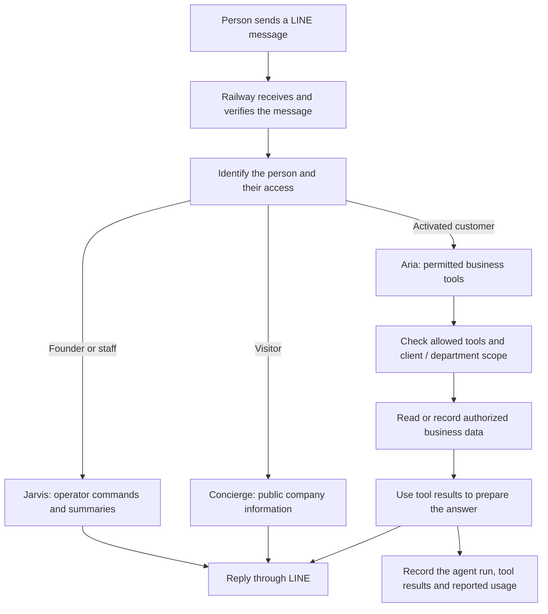

# Neurohands — AI agents for business

Neurohands aims to give a business an AI workforce that can answer questions, use approved business tools, work with company documents and report what it did. The owner decides each agent's responsibilities and access.

**Today, this is a v3.10 pilot for KNC Glass.** The LINE gateway, customer agent, owner console and document portal are implemented and deployed. The next milestone is proving a complete customer conversation about a real uploaded document. The larger team and department platform is still under development.

## Who does what?

| Role | Who uses it? | What it does in the current pilot |
| --- | --- | --- |
| **Jarvis — owner/operator assistant** | The founder and authorized staff | Shows business summaries, agent runs and errors; issues customer activation codes and upload links; inspects documents; handles explicit operator commands and approved tool actions. |
| **Aria — customer business agent, AGT-001** | An activated customer | Uses permitted tools to look up products, orders and lead times; read that customer's available documents; record useful customer facts, support cases and follow-up tasks. |
| **Concierge — public receptionist** | A visitor who has not activated customer access | Explains the business using configured company information and guides visitors toward a demo or activation. It does not receive private customer tools. |

These are **three application roles using AI models**. We have not trained three new models. The roles can use the same AI engine while having different instructions, permissions and information. Gemini is enabled by default; setting `GEMINI_ENABLED=false` lets the configured alternative provider handle requests directly while retaining the saved Gemini key. The current replacement candidate is OpenRouter's explicitly free `openai/gpt-oss-120b:free`, pending its private key and live verification.

Jarvis currently provides an operator interface. Automatic delegation among independent agents, departments and managers is part of the future platform.

## How a request moves through the system



For example, a customer asks about an order. The application identifies their account, Aria requests an allowed order lookup, and the server limits the lookup to the authorized account. Aria uses the returned information to answer. An operator can inspect the run and tool results afterward. If a required service fails, the system should report that failure; it must not treat a guessed answer as verified business data.

| Part of the system | Its job |
| --- | --- |
| **LINE Official Account** | The conversation customers and the owner see. |
| **LINE Developers console** | Connects that OA's Messaging API channel to the application's webhook and credentials. |
| **GitHub** | Stores the source code, documentation and change history. |
| **Railway** | Runs the application, receives LINE events and calls the connected services. |
| **Supabase** | Stores business records, customer access, private documents, saved facts and execution records. |
| **Selected AI provider** | Supplies AI responses and tool requests; the application enforces access. |

Connecting GitHub to Supabase alone does not connect LINE or configure Railway's runtime credentials. Each connection has its own purpose.

## Documents and customer activation

An **upload link** gives permission to submit a document. An **activation code** links a customer's LINE account to the correct company and department. They serve different purposes.

1. In the founder's LINE chat, send `code: KNC sales` to create a private customer activation code.
2. The customer uses their own LINE account on the same OA and sends `activate ` followed by the **complete private code beginning `NH-`**. A shortened code hint is not sufficient.
3. After successful activation, the customer sends `upload` to receive their secure link. The founder can also issue a link with `upload: KNC sales`.
4. Upload the file through that portal. The application stores the original privately and extracts supported content.
5. Ask Aria a question about the uploaded document. Aria must retrieve its content with an allowed document tool before answering from it.
6. The operator checks the answer against the original and inspects the corresponding run and successful document tool call.

The founder account routes to **Jarvis**, so use a second personal LINE account for the customer/Aria test. Aria is enabled through account activation; there is no separate Aria file to attach to LINE.

Word, Excel and CSV extraction are implemented. Partial extraction is labeled. PDF files are currently stored without text extraction. This version uses the secure portal; files attached directly in LINE are not ingested by the application. Uploading a document does not retrain the AI model.

## Current status — 9 September 2026

This section supersedes older deployment statements in the linked September 7–8 records. The statuses below distinguish completed checks from the next live proof.

| Status | What the evidence establishes |
| --- | --- |
| **Verified** | Application code and the simpler overview are published in the destination GitHub repository. Railway runs commit `c57de7e`; its build passed **101 tests**, and readiness/version endpoints were checked. The newer provider-switch repair passes **107 local tests** and is awaiting deployment. |
| **Verified** | The recovered Phase 1 database and private document bucket are configured. All 131 original database records were preserved and checked. One pilot document has been uploaded and parsed. |
| **Verified, limited scope** | LINE has delivered messages to the application and received replies, including operator upload links and failure replies. This establishes connectivity, not reliable AI answers. |
| **Implemented; full live proof pending** | Aria's document tools, activation, access checks, run traces and usage recording have automated tests. The full second-account customer activation → correct document answer → successful authorized trace remains unverified. |
| **Provider replacement pending** | A founder request reached the application's 15-second timeout while waiting for Gemini. The saved Groq key still returned HTTP 401 after a fresh restart. OpenRouter's free replacement is prepared; its private key and live answer remain to be verified. See [free provider setup](docs/FREE_PROVIDER_SETUP.md). |
| **Planned / experimental** | The broader team website, automatic delegation, department workflows, recurring task execution, semantic document search and external connector framework are not established live capabilities. The experimental `/studio` website remains disabled for this milestone. |

The current repository and destination service are available, but the complete original-account migration and source deployment inventory remain unfinished. Preserve the original resources until that reconciliation is complete.

See the [acceptance checklist](docs/GOAL_ACCEPTANCE.md), [dated live test evidence](docs/LIVE_STATUS.md), [Phase 1 recovery record](docs/PHASE1_STATUS.md) and [longer-term project plan](docs/PROJECT_PLAN.md).

## How this can grow into an AI workforce

The following describes the **intended expansion**, not a claim that these multi-agent workflows already run.

| Level | Example of the intended work | How it helps the business | What must be added or proven |
| --- | --- | --- | --- |
| **Individual agent** | Aria answers a customer's question from approved records and captures a follow-up. | Reduces repeated lookups and keeps a record of the answer and action. | Complete the current live pilot; measure answer quality, speed and usage. |
| **Team** | A sales agent gathers requirements, a document agent checks specifications and a planning agent prepares the next steps. | Divides a larger request into clear, coordinated jobs. | Assignment, handoffs, dependencies, shared evidence and a verified combined result. |
| **Department** | A sales department coordinates enquiries, quotations and follow-ups; an operations department tracks delivery exceptions. | Gives each department a consistent process, accountable work queue and performance view. | Department-specific tools and permissions, approvals, scheduling and realistic evaluation. |
| **Organization** | Jarvis gives the owner a view across departments, identifies blocked work and proposes priorities. | Connects customer requests to business-wide decisions while keeping the owner in control. | Cross-department coordination, resource and budget limits, connector monitoring and measured organization-level outcomes. |

An engineering team is also part of the goal: turn an approved request into requirements, a design, implementation, tests and a reviewed release for websites, software or integrations. Hardware designs and simulations would require separate physical verification. These are future capabilities, not work completed by the current LINE pilot.

The intended full process is: **understand the request → define success → check access and evidence → plan and assign → execute → verify → report → record and improve**. Each expansion must demonstrate a useful improvement against a baseline before being treated as ready.

## What we measure, and what remains unknown

- **Tokens:** text processed by a model. Aria's run records can include provider-reported input, output, reasoning and cached-token counts, plus each attempted model request. Missing usage is marked unknown, not zero. These totals are not an invoice or a spending cap.
- **Time:** model request time and agent run time are recorded. The run timer excludes some setup and LINE delivery, so it is not the complete customer wait time.
- **Customer memory:** selected facts saved in the database for later use. This is different from Railway's RAM and from the AI model's training.
- **CPU and RAM:** Railway reports the application server's resource use. Those figures do not measure the remote AI provider's computers. Per-customer capacity and realistic load limits remain unmeasured.
- **Quality:** the next proof must show a correct answer from the right customer's document and a successful permitted tool record. Automated tests alone do not establish live reliability.

The operating requirement is **$0 new spending within verified free allowances**. Free allowances, rate limits and hosting credits must be checked before further live AI tests or deployments. A provider being reachable does not prove its use is free. No free-capacity or monthly-cost guarantee is claimed.

## Setup and operation

The current application base is [neurohands-ai-agent-production.up.railway.app](https://neurohands-ai-agent-production.up.railway.app). Its LINE webhook URL is:

```text
https://neurohands-ai-agent-production.up.railway.app/webhook
```

In the intended LINE channel's Messaging API settings, set that URL, verify it and enable webhooks. Keep the channel secret and access token in Railway Variables. The same channel must belong to the OA being tested.

Use [`.env.example`](.env.example) for the configuration names. Store real keys privately in Railway or a local `.env`, never in GitHub. Core connections use `LINE_CHANNEL_SECRET`, `LINE_CHANNEL_ACCESS_TOKEN`, `SUPABASE_URL`, `SUPABASE_SERVICE_KEY`, and the configured model provider's key. `WEBHOOK_ENCRYPTION_KEY` protects stored incoming events and must remain stable across restarts. `FOUNDER_LINE_ID` identifies the operator. Backend API and scheduled digest routes have separate secrets.

| Guide | Use it for |
| --- | --- |
| [Railway setup record](docs/RAILWAY_SETUP.md) | Service identifiers and build/start settings; its September 7 “not deployed” status is historical. |
| [Supabase readiness](supabase/README.md) | Applied Phase 1 schema, access and document storage checks. Do not substitute the experimental Phase 2 migration. |
| [Webhook recovery](docs/WEBHOOK_RECOVERY.md) | Failed or interrupted events, safe recovery and preserving the encryption key. |
| [Live evidence](docs/LIVE_STATUS.md) | Dated diagnostic results and the customer proof requirements. |
| [Free provider setup](docs/FREE_PROVIDER_SETUP.md) | Private OpenRouter key entry, disabling Gemini without deleting its key, and the live verification sequence. |

Useful founder commands are `help`, `brief`, `agents`, `runs`, `events`, `trace: <run_id>`, `docs: KNC` and `upload: KNC sales`. Creating a follow-up or checklist item records work; it does not mean an autonomous scheduler will execute it.

## Developer quickstart

Use **Node.js 24** in the repository root:

```powershell
npm ci
Copy-Item .env.example .env
npm run check
npm test
npm run build
```

Checks and automated tests use simulated external services and can run without real credentials. To run the application, configure `.env` privately, keep `ENABLE_STUDIO=false` for the pilot, then run `npm start`. Observe the spending requirement before enabling live provider calls.

`/ready` checks required runtime configuration, database readiness and private storage. `/version` identifies the deployed commit. Neither endpoint proves that an AI conversation succeeds.

| Location | Contents |
| --- | --- |
| [`src/server.js`](src/server.js) | LINE routing, agent runtime, permitted tools, Jarvis commands and document portal. |
| [`src/lib/`](src/lib/) | Supporting security, document handling, webhook recovery and model metrics. |
| [`web/`](web/) and [`src/platform/`](src/platform/) | Experimental website/workspace implementation, disabled during the pilot. |
| [`supabase/`](supabase/) | Schema migrations and database verification notes. |
| [`test/`](test/) | Regression and integration tests using simulated providers or isolated databases. |
| [`config/rich-menus/`](config/rich-menus/) and [`assets/rich-menus/`](assets/rich-menus/) | LINE menu definitions and images. |
| [`docs/`](docs/) | Evidence, acceptance criteria, recovery provenance and implementation plans. |

`npm run richmenu:check` validates the menu files locally. `npm run richmenu:setup` creates menus in LINE, uploads images and stores menu IDs; it makes real external changes and must only target the intended channel. Repeating it creates new menu IDs.

The complete server was recovered from an original Word document after the initial downloaded source was found truncated. Recovery provenance is retained in [`docs/recovery-manifest.json`](docs/recovery-manifest.json) and [`docs/originals/`](docs/originals/). Preserve change history and originals; use reviewed revert/deployment rollback procedures rather than deleting working evidence or blindly replaying failed actions.
