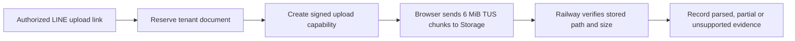

# Large-file upload architecture

## Verified current limits

Checked on 17 September 2026:

- the connected `Neurohands` Supabase organization reports plan `free`;
- [Supabase Free allows 50 MB per file](https://supabase.com/docs/guides/storage/uploads/file-limits);
- [Supabase Free includes 1 GB total file storage](https://supabase.com/pricing); and
- the live private `neurohands-docs` bucket reports a 10,485,760-byte
  (10 MiB) limit.

The production portal therefore still accepts at most 10 MiB. The development
branch targets an exact **50,000,000-byte** ceiling, which stays within the
documented Free-plan per-file maximum. No 100 GB production capability is
claimed.

## Staged direct-upload path

Changing the old Express request limit alone would make Railway buffer the
complete file in memory. The staged implementation is designed to:

1. validate the signed LINE upload link, active client and department binding;
2. reserve an immutable tenant-specific document path;
3. give the browser a short-lived signed Storage capability;
4. send fixed 6 MiB TUS chunks directly to the Supabase Storage hostname;
5. resume interrupted transfers without mixing tenant fingerprints;
6. refresh the short-lived signature during a long transfer;
7. verify the authoritative stored size before finalization; and
8. remove an object whose stored size differs from its reservation.

Files of 10 MiB or less follow the existing bounded extractor. The staged path
is designed to retain larger files as private originals, but automatic
extraction is not implemented for them, so the record is labeled `unsupported`
rather than presented as agent-readable. Local mocked-Storage tests exercise
this behavior; no live large-file transfer has proved it.

## Activation gates

Keep production `RESUMABLE_UPLOAD_ENABLED=false` while the path is staged.

Complete these prerequisites before a controlled acceptance run:

1. apply `20260917103000_resumable_upload_metadata.sql`;
2. add an atomic per-tenant quota that also protects the 1 GB Free-plan total;
3. add cleanup for abandoned reservations and partial uploads;
4. verify the project-wide limit permits exactly `50000000` bytes;
5. set the private bucket limit to exactly `50000000` bytes and read it back;
   and
6. set `UPLOAD_MAX_BYTES=50000000` while leaving the production feature gate
   false.

Then run controlled acceptance:

1. enable the feature only in the controlled acceptance deployment or window;
2. confirm `/ready` reports the exact bucket match;
3. run real boundary, interruption, resume, expiry, revoked-user,
   wrong-department, quota and cleanup tests; and
4. disable the feature immediately and clean up the test state if any check
   fails.

Enable the feature for ordinary production use only after the controlled run
passes and its evidence is retained. No paid-plan or billing change is part of
this Free-plan acceptance path.

The local tests use mocked Storage responses. They verify application behavior,
not Supabase's live transfer capacity. `/ready` checks the private bucket when
the feature is enabled; it does not prove a real TUS transfer.

## Future 100 GB request

The current Free plan cannot accept a 100 GB file. Supabase's current
[limits page](https://supabase.com/docs/guides/storage/uploads/file-limits) and
[pricing page](https://supabase.com/pricing) advertise up to 500 GB per file on
paid plans, while a separate current
[troubleshooting page](https://supabase.com/docs/guides/troubleshooting/upload-file-size-restrictions-Y4wQLT)
still says TUS and S3 transfers support up to 50 GB. Because the official pages
conflict, a future 100 GB design must remain a proposal until the selected paid
plan, dashboard configuration and a representative live upload prove it. Any
paid-plan or spending change requires explicit approval.
