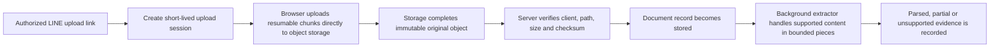

# Large-file upload architecture

## Current state

The production portal accepts one file through Railway, keeps the complete file
in server memory, uploads it to Supabase Storage and then parses it. The browser,
Express endpoint, database constraint and Storage bucket currently enforce a
10 MiB limit.

Changing those four numbers to 100 GB would not create a working 100 GB upload.
It would require Railway to hold a 100 GB request in memory, exceed the current
Supabase Free per-file and total-storage limits, and make a short network
interruption restart the whole transfer.

## Safe 100 GB flow

The production implementation must:

1. use a storage plan that permits a 100 GB object and enough total capacity;
2. send file bytes directly from the browser to storage with resumable or
   multipart upload, never through Railway memory;
3. bind the short-lived session to one client, department, filename, object
   path, size limit and expiry;
4. keep service credentials in the server and never expose them to the browser;
5. support resume, retry and cancellation without creating duplicate originals;
6. finalize only after storage confirms the object and the server verifies its
   expected size and checksum;
7. parse asynchronously with strict CPU, memory, decompression and row limits;
8. keep the original private even when extraction is partial or unsupported;
9. record storage usage, upload duration, failures and cleanup of abandoned
   multipart sessions; and
10. test revoked links, wrong-client paths, altered metadata, interrupted parts,
    duplicate finalization and quota exhaustion before enabling it for clients.

## Current decision boundary

As verified against Supabase's current documentation on 17 September 2026,
[Free projects allow at most 50 MB per file](https://supabase.com/docs/guides/storage/uploads/file-limits)
and the [Free plan includes 1 GB of file storage](https://supabase.com/pricing).
Paid plans can configure a larger per-file limit, but a 100 GB object still
needs sufficient storage capacity. Supabase recommends
[TUS resumable uploads](https://supabase.com/docs/guides/storage/uploads/resumable-uploads)
for large browser uploads and its direct storage hostname; the standard upload
path is not appropriate for a 100 GB file.

Supabase Free therefore cannot supply a 100 GB production upload. The safe
zero-cost choices are to retain the small cloud portal or build a laptop-only
100 GB test, which would work only while that laptop and its network route are
available. Production cloud support needs an explicitly approved compatible
storage plan.

Until that choice is made, the deployed 10 MiB limit remains unchanged and no
100 GB capability is claimed.
