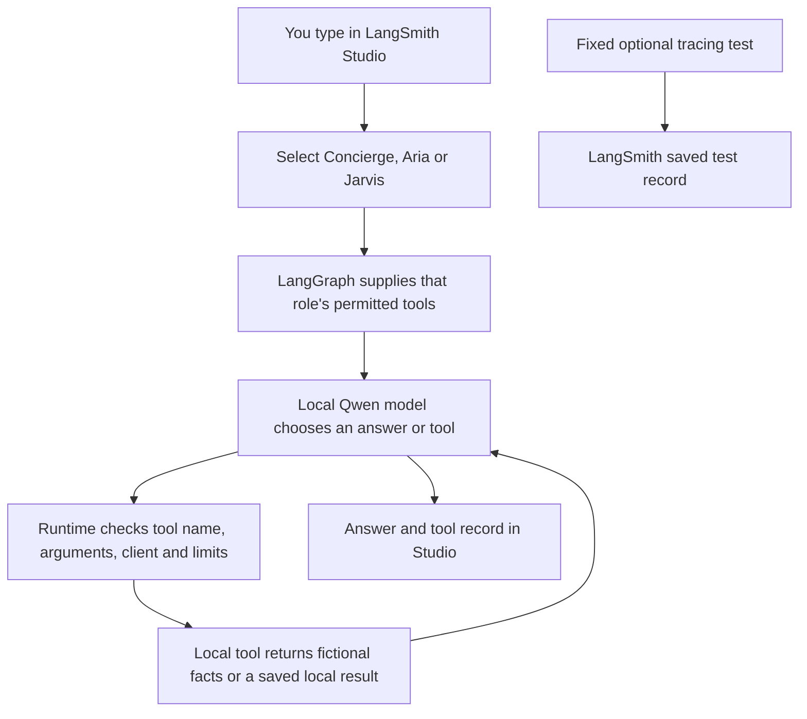

# Test Concierge, Aria and Jarvis locally

This lab connects Studio, LangGraph and the local Qwen model to small, executable tools. All company records are fictional. These are three roles using the same model; no new model was trained.



## Start and choose an agent

1. Open the Neurohands project folder in Terminal.
2. Run `npm run lab:studio` and leave the terminal open.
3. Open [the local Studio workspace](https://smith.langchain.com/studio/?baseUrl=http://127.0.0.1:2024).
4. Choose one of the agent names below, select **Chat**, then start a **new thread**.
5. Type a fictional test request and send it. Use the same thread for follow-up questions.

| Studio agent | Purpose | Available local skills |
| --- | --- | --- |
| `neurohands_concierge` | Public receptionist | Company facts and calculator |
| `neurohands_aria` | Client assistant | Concierge skills, order lookup, document reading, task list/create, fact save/recall |
| `neurohands_jarvis` | Team coordinator | Aria skills plus delegating a bounded request to Aria or Concierge |
| `neurohands_chat` | Comparison baseline | Plain model chat with recent conversation; no tools |
| `neurohands_test` | Connection check | Deterministic echo; no model |

Try these in the matching agent:

```text
Concierge: What does Mango Works do?
Aria: Check order DEMO-ORDER-001.
Aria: Read DEMO-DOC-001 and tell me the cover-printing lead time.
Aria: Calculate (7 * 45 + 3 * 18) * 0.9 + 25.
Aria: Remember that the fictional preferred delivery day is Tuesday.
Aria: What delivery day did you save?
Aria: Create a local task titled Prepare demo quote.
Aria: List my local tasks.
Jarvis: Delegate to Concierge to check Mango Works services, then summarize its answer.
```

The default client is `DEMO-CLIENT`. The fixture company is Mango Works. Task creation and memory affect only this local conversation. They do not create a business record, send a message, or notify anyone.

## Repeat the before-and-after test

The suite contains **18 synthetic scenarios**. It tests English/Thai answers, clarification, order/document tools, arithmetic, supplied conversation, planning, failed actions, duplicate avoidance and permission boundaries. It is a starter test, not every industry benchmark.

The [measured results](AGENT_BENCHMARK_RESULTS.md) show 17/36 passes before tools and 24/36 after tools, with remaining failures listed. These are reviewed synthetic attempts, not a production reliability promise.

```powershell
npm run lab:benchmark:baseline -- --rounds 2
npm run lab:benchmark:equipped -- --rounds 2
```

Run them sequentially, with other model chats idle. Reports appear in `artifacts/benchmarks/`. Each includes actual answers, tool calls, model version, fixture/source hashes, token counts, first text token time, total task time, and sampled model-process memory/CPU. The runner does **not** automatically grade correctness or upload the benchmark to LangSmith. Use [the review rubric](AGENT_BENCHMARK_RUBRIC.md) and inspect the saved outputs.

With Studio running, `npm run lab:agent:check` tests 11 actual API workflows including tool calls, local memory, duplicate tasks and a Jarvis handoff. These are execution/state assertions; read the answers too. Task creation currently supports a title only, with no scheduling or department assignment.

The equipped condition changes role instructions and adds tools while keeping the base model and per-call generation settings fixed. Extra tool steps use extra calls/tokens. This compares the two complete systems; it does not prove the model itself became more intelligent.

To record one fixed Aria tool test in LangSmith:

```powershell
npm run lab:agent:trace
```

That command sends only its built-in fictional order test and checks the completed record in `neurohands-local-test`. Ordinary chat and bulk benchmark tracing stay off. Full automatic in-Studio tracing remains a separate compatibility limitation.

## Connection and state details

The prepared laptop uses `http://127.0.0.1:11435` for its dedicated lab model. The separately installed Ollama desktop app uses port `11434` and may have a different model folder. Preserve the working `LAB_OLLAMA_BASE_URL` and `LAB_OLLAMA_EXE` values in the private `.env.langgraph` file. A fresh machine using the normal Ollama installation can use port `11434` after downloading its model there.

`LAB_STATE_SIGNING_KEY` is a private local-state key, already generated in the prepared environment. It lets server workers verify their own tool and memory state. It is not an LLM API key. Losing or replacing it means old agent threads with signed tool/state data must be restarted. The original plain-chat threads are unaffected.

The agent has bounded model/tool calls and a time limit. It can ask you to split a large task. Context limits may omit older turns; this is a small model lab, not unlimited or permanent memory. Local development state is not a business backup system.

## Remaining limits

The laptop must be running. Gemini takeover, production LINE integration, live company databases, internet research, external MCP connectors, unattended schedules and permanent customer storage are outside this local test. There is no autonomous permission expansion or unrestricted computer access. A successful lab result does not prove production reliability.

Some model answers may still be wrong or unhelpful. Keep the failed cases visible, review the tool evidence and add new unseen cases before expanding access. These changes add usable tools and tests; they do not fine-tune model weights or guarantee every task succeeds.
