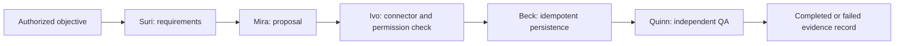

# Named-agent workflow laboratory

This is an **isolated local experiment**. It does not run inside the production
LINE service and it cannot access a real customer, Supabase record, Railway
service or internet connector.

Its purpose is to answer a smaller question first: can Neurohands assign a
bounded objective to named roles, restrict each role to its approved tools,
pass evidence between roles, avoid duplicate work and record a reviewable
result?

## Fixed roles in this experiment

| Agent | Department | Responsibility in the fixed workflow |
| --- | --- | --- |
| Suri | Sales | Collect requirements and prepare quote inputs |
| Mira | Marketing | Prepare an evidence-grounded campaign proposal |
| Ivo | IT | Check connector readiness, permissions and client boundaries |
| Beck | Backend engineering | Persist the approved result with an idempotent operation |
| Quinn | AI engineering and QA | Recalculate the evidence and decide whether the workflow passes |

Each role has a fixed identity, department, responsibility list, tool allowlist
and allowed next recipient. A model response cannot grant itself another role,
client, tool or recipient.

## Execution flow



The runtime stores append-only local evidence for every step. The next role
receives only the authorized handoff for the same workflow and client. Failed,
timed-out or denied work must be recorded as failed; model prose alone is not
confirmed evidence.

## Three local configurations

- `individual`: one generalist step, used to verify the smallest execution
  path.
- `pair`: a work step followed by QA, used to verify a handoff and independent
  review path.
- `full_department`: all five fixed roles, used to verify the complete local
  orchestration path.

These configurations currently have different structural duties. Their raw
scores must **not** be used to claim that five agents are more capable than one
or two. A fair effectiveness comparison requires the same objective, duties,
tools, total budget and grading criteria for every configuration, followed by
repeated runs using the real local model.

The recorded real-model evidence below contains **one sample per topology**, and
each topology received a different task: a basic arithmetic quotation, an
intermediate document-grounded quotation with QA, and an advanced
five-department dossier. It therefore provides no capability or team-size
ranking.

## What the deterministic check proves

The deterministic check uses injected, fixed responses. It is designed to
prove workflow plumbing and safety rules without spending model credits:

- fixed role and handoff enforcement;
- client authorization and scoped reads;
- tool allowlists and nested foreign-client rejection;
- client-scoped idempotency and duplicate prevention;
- timeout, failure and storage-budget records;
- ledger-based QA and tamper-oriented fixture self-checks;
- measured local wall time and stored evidence bytes.

Its token values are synthetic fixtures. It does not measure model reasoning,
answer quality, business accuracy, real connector success, production capacity
or LINE reliability.

## Exact local commands

Run these commands from the repository root. The `--out` paths below are the
paths used by the evidence tables, so use a new filename when preserving the
recorded samples.

```powershell
node scripts/team-workflow-benchmark.mjs --self-check
node scripts/team-workflow-benchmark.mjs --out artifacts/benchmarks/2026-09-16-team-workflow-deterministic.jsonl

node scripts/real-named-workflow-benchmark.mjs --dry-run
node scripts/real-named-workflow-benchmark.mjs --topology individual --suite-timeout-ms 900000 --out artifacts/benchmarks/2026-09-17-real-named-individual.json
node scripts/real-named-workflow-benchmark.mjs --topology pair --suite-timeout-ms 900000 --out artifacts/benchmarks/2026-09-17-real-named-pair-attempt3.json
node scripts/real-named-workflow-benchmark.mjs --topology full_department --suite-timeout-ms 900000 --out artifacts/benchmarks/2026-09-17-real-named-full-department-attempt2.json
```

The dry run validates configuration without model inference, a network request
or an artifact write. The real runs permit only the loopback Ollama endpoint and
fixed local tools. Their fixtures are synthetic; production services, external
connectors and LangSmith upload are disabled.

## Recorded deterministic conformance

Source: [`2026-09-16-team-workflow-deterministic.jsonl`](../artifacts/benchmarks/2026-09-16-team-workflow-deterministic.jsonl).

| Topology | Runtime result | Structural eligibility | Conformance | Wall time | Synthetic tokens | Tool calls | Evidence storage |
| --- | --- | --- | ---: | ---: | ---: | ---: | ---: |
| `individual` | Completed | No; four required roles absent | 2/10 | 8.027 ms | 176 | 1 successful | 2,657 bytes / 3 records |
| `pair` | Completed | No; three required roles absent | 2/10 | 9.600 ms | 304 | 2 successful | 6,283 bytes / 7 records |
| `full_department` | Completed | Yes; all five roles present | 10/10 | 22.274 ms | 756 | 2 successful | 19,514 bytes / 19 records |

The fixture mutation self-check passed: three deliberately false pricing
mutations and one step-scope pseudo-write mutation were rejected. The
four-record report is self-consistent at 32,430 bytes. Fetch interception was
enabled and recorded zero attempted fetches.
Completion in the one- and two-agent rows means their configured paths ran to a
terminal state; it does not mean they covered the five-role objective.

## Recorded real local Qwen samples

| Artifact and topology | Outcome | Wall time | Provider tokens | Local tools | Evidence storage | Peak sampled model RAM | Sampled model CPU | Direct evidence |
| --- | --- | ---: | ---: | --- | ---: | ---: | ---: | --- |
| [`individual`](../artifacts/benchmarks/2026-09-17-real-named-individual.json) | **Pass**: `completed`; 11/11 structural checks passed | 15,614 ms | 1,885 | 1 successful `calculate` | 2,598 bytes / 3 records | about 1,935.6 MiB | 95.156 s | Suri returned the correct 2,600 THB draft. |
| [`pair`, attempt 2](../artifacts/benchmarks/2026-09-17-real-named-pair-attempt2.json) | **Failed safely**: workflow `failed`; 11/11 structural checks passed | 17,758 ms | 6,651 | 4 successful; 0 rejected | 6,803 bytes / 7 records | about 2,188.3 MiB | 139.234 s | Suri correctly returned 2,040 THB and the document-grounded four-working-day lead time. The handoff was recorded, but Quinn produced an empty final answer and failed. |
| [`full_department`](../artifacts/benchmarks/2026-09-17-real-named-full-department.json) | **Failed safely**: workflow `failed`; 11/11 structural checks passed | 14,605 ms | 4,514 | 3 successful; 1 rejected | 7,989 bytes / 11 records | about 2,313.3 MiB | 112.984 s | Suri misrouted `40 * 110 + 600` to `get_order_status`; the call was rejected, Suri failed, and the other four roles were blocked. |

The separate [technical-lead review](../artifacts/benchmarks/2026-09-17-real-named-review.json)
keeps semantic correctness distinct from the automatic structural checks and
preserves the first pair attempt as incident evidence.

## Post-guardrail reruns

The runtime then restricted every fixed step to its exact tool subset and added
one bounded retry for a model response containing neither text nor tool calls.
The global call limits did not increase. The same failed pair and department
fixtures were each rerun once; the earlier artifacts remain unchanged.

| Artifact | Runtime outcome | Human review | Tokens | Tools | Wall time | Storage | Peak sampled RAM / sampled CPU |
| --- | --- | --- | ---: | --- | ---: | ---: | --- |
| [`pair`, attempt 3](../artifacts/benchmarks/2026-09-17-real-named-pair-attempt3.json) | `completed`; 11/11 structural checks | **Partial:** both agents verified 2,040 THB, but their final prose omitted the exact four-working-day lead time | 3,414 | 4 successful | 22,256 ms | 6,615 bytes / 7 records | about 2,025.8 MiB / 160.500 s |
| [`full_department`, attempt 2](../artifacts/benchmarks/2026-09-17-real-named-full-department-attempt2.json) | `failed`; 11/11 structural checks | Suri read the document and calculated 5,000 THB, then two empty replies exhausted the one permitted retry; four dependent roles were blocked | 3,334 | 2 successful | 13,092 ms | 7,080 bytes / 11 records | about 2,235.4 MiB / 100.203 s |

The [post-guardrail technical review](../artifacts/benchmarks/2026-09-17-real-named-review-after-guardrails.json)
records the before/after limits. A structurally completed workflow is not a
business-quality pass when required answer content is missing.

Here, **failed safely** means the failure and blocked states were persisted, the
runner closed, and ephemeral storage was removed. It does not mean the business
task passed. RAM and CPU cover sampled local Ollama/`llama-server` processes,
not the runner or the whole machine.

## Required evidence before LINE deployment

1. All focused workflow and repository regression tests pass.
2. The deterministic fixture mutation self-check proves that false proposal
   values fail grading.
3. A fair real-model comparison runs repeated unseen basic, intermediate and
   advanced objectives for one, two and five agents.
4. Each real-model report records task correctness, tool results, retries,
   failures, wall time, actual provider token metadata when available, local
   model CPU/RAM and workflow evidence storage.
5. Cross-client, duplicate-action, timeout and interrupted-run tests pass.
6. A human reviews failed answers and approves the exact production adapter.
7. Production integration starts with one reversible, low-risk LINE test and a
   rollback path; broader tools remain disabled until that test passes.

Until those checks are complete, this named team remains a local laboratory and
the existing production Jarvis, Aria and Concierge behavior is unchanged.
