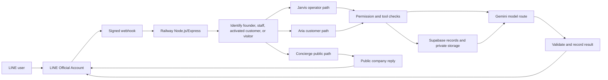
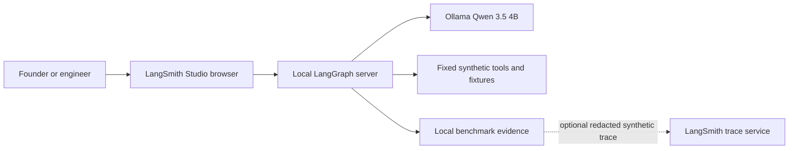
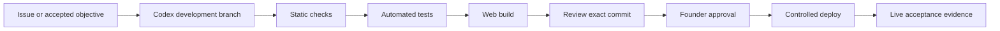

# Neurohands project history and technical map

**Evidence snapshot:** 18 September 2026, Asia/Bangkok  
**Repository:** `tanadanaitan-prog/neurohands-ai-agent`  
**Application version:** `3.10.0`  
**Purpose of this file:** consolidate what has been built, which language runs on which platform, how the parts connect, what has been verified, and what remains incomplete.

This file contains no passwords, API keys, access tokens, signed upload links, activation codes, private LINE identifiers, or customer document contents. Some secrets were previously shown in chat or screenshots; their rotation status is not evidenced in the repository, so they must not be treated as safe merely because they are absent here.

## 1. Evidence rules used in this record

The status words have strict meanings:

- **Production:** present on production `main` and supported by dated deployment evidence.
- **Connected:** the communication path was observed working, within the stated scope.
- **Verified locally:** a repeatable local check or test passed with synthetic data.
- **Staged:** code exists on a development branch but is disabled, unapplied, unaccepted, or not deployed.
- **Installed only:** software or a model is present, but Neurohands has not connected and tested it for the proposed role.
- **Planned:** a goal or design, not an implemented capability.
- **Unknown:** current evidence is insufficient. Unknown never means zero, safe, or unlimited.

Repository files, commit history, machine-readable evidence, and dated runtime observations are treated as stronger evidence than an intention or screenshot alone. A local test does not prove production behavior, and a successful network request does not prove answer quality.

## 2. Current snapshot

| Item | Current evidence-based status |
| --- | --- |
| Production source | `origin/main` at `a315fdd0cad03a5339abb87440c83061fc401dbe`, the merged Gemini adapter repair from PR #14. |
| Development source | `codex/langgraph-local-test` was at `e506d233d02413182b2a15ce2a78f6575929d483` before this archive was added, 17 commits ahead of production `main`. |
| Remote development branch | The remote branch was at `ccc06f1563d8e3251e460aae358ced2870cc4e33`; the local Aria Qwen tool-smoke commit had not yet been pushed. |
| Production runtime evidence | Latest repository evidence is dated 16 September 2026. Railway could not be freshly queried from the current restricted environment. |
| Local runtime now | Direct checks on 18 September found ports `127.0.0.1:2024` and `127.0.0.1:11434` unavailable. LangGraph Studio and Ollama are currently stopped, although earlier bounded tests passed. |
| Current automated source checks | `npm run check`, **511/511** tests, and `npm run build` passed on 18 September 2026. |
| Release gate | **Failed by design:** 4 controls pass and 8 remain partial. Six controls have passing deterministic local machine probes; C03 and C04 remain partial because live requirements are incomplete. No release acceptance or founder approval is recorded. |
| Account allowances | Nine externally metered services have unresolved private allowance data. No unknown balance is treated as available capacity. |
| Sineid Glass Decor | On hold by founder instruction. Its current local profile/documents are untracked and must not be represented as an implemented pilot. |

The main boundary is:

> **Production LINE uses Railway, Supabase, and Gemini. The local LangGraph/Ollama agent laboratory is separate and is not connected to production LINE.**

## 3. Product goal and present milestone

The long-term goal is a configurable business AI-agent platform where a client can define agents, teams, departments, tools, permissions, evidence requirements, budgets, and quality standards.

The accepted near-term milestone remains narrower:

1. a real user contacts the Neurohands LINE Official Account;
2. the application identifies the user and role correctly;
3. an activated KNC customer is limited to the correct company and department;
4. Aria retrieves an authorized real document or business record through an allowed tool;
5. the answer matches the source;
6. the run and tool evidence prove what happened; and
7. wrong-client, provider-failure, database-failure, and delivery-failure cases fail safely.

The codebase contains much of this path and extensive simulated tests. The complete second-LINE-account production proof from activation through a correct document answer and successful authorized `read_document` trace is still incomplete.

## 4. System architecture

### 4.1 Production path

### 4.2 Local engineering laboratory

The laptop must be on, Ollama must be running, and the local LangGraph server must be running for this path. Railway cannot use the laptop's `127.0.0.1` address. No automatic Ollama-to-Gemini or Gemini-to-Ollama switch is connected.

### 4.3 Engineering and release path

The staged policy is **issue → branch → patch → tests → review → founder approval → deploy**. Current development work has not passed the complete release gate and has not been merged or deployed.

## 5. Coding languages, formats, and platforms

| Language or format | Main files | Where it runs or is used | Status |
| --- | --- | --- | --- |
| JavaScript, CommonJS | `src/server.js`, `src/lib/*.js`, `src/platform/*.js`, `scripts/*.js`, `test/*.js` | Node.js 24 on Railway, local Windows tests, GitHub Actions | Core production backend and most control/test code. |
| JavaScript, ES modules | `src/agent/*.mjs`, `scripts/langgraph-lab.mjs`, benchmark scripts, `web/vite.config.mjs` | Local LangGraph/Ollama lab and Vite build | Verified locally on the development branch; not deployed to LINE. |
| Browser JavaScript | `web/src/main.js` | Browser calling the experimental `/api/studio` API and Supabase Auth | Staged; `ENABLE_STUDIO=false` by default. |
| PostgreSQL SQL / PL/pgSQL | `supabase/migrations/*.sql`, `supabase/check-readiness.sql` | Supabase Postgres | Some Phase 1/Jarvis migrations applied; later workspace, upload, admission, approval, continuity, and idempotency work includes staged migrations. |
| HTML | `web/index.html`; upload-page HTML generated in `src/server.js` | Browser | Upload portal is in the server; agent/team builder UI is staged. |
| CSS | `web/src/style.css`; inline upload styles | Browser | Builds successfully; team-builder deployment remains disabled. |
| JSON | `railway.json`, `langgraph.json`, `config/*.json`, rich-menu files, fixtures, benchmark artifacts | Railway/LangGraph configuration, policies, LINE assets, tests, evidence | Active configuration plus staged policy/evidence records. |
| YAML with bounded shell steps | `.github/workflows/untrusted-pr.yml` | GitHub Actions, Ubuntu and isolated Docker test container | Workflow is configured; its latest remote execution outcome was not reverified here. |
| dotenv templates | `.env.example`, `.env.langgraph.example` | Railway Variables and private local environment files | Templates are tracked; real secrets are excluded from Git. |
| Markdown | `README.md`, `docs/*.md` | Human documentation | Describes design and evidence; it is not executable proof. |
| JSONL | Team-workflow benchmark evidence | Local test evidence | Data, not runtime code. |
| PNG | `assets/rich-menus/*.png` | Uploaded through LINE Messaging API tooling | Assets exist; current LINE-side rich-menu assignment was not freshly checked. |
| XLSX/CSV/DOCX/PDF | Private uploaded business documents | Supabase Storage and parsing pipeline | Business data, not application code. PDF text extraction is not implemented in this version. |

There is **no tracked TypeScript or Python application runtime**. Any ignored temporary third-party TypeScript source is audit material, not Neurohands application code.

## 6. Platform-by-platform status

| Platform | Responsibility | Connection status | What is proven | What is not proven |
| --- | --- | --- | --- | --- |
| GitHub | Source history, branches, pull requests, CI | Connected | The audited pre-archive history contained 104 commits from 7–18 September; production and development branches are distinguishable. The archive and its later evidence updates add further commits. | Current private plan/Actions allowance and the latest remote workflow outcome were not reverified. |
| Railway | Hosts the production Node/Express service | Connected in last dated evidence | Builds, `/ready`, `/version`, webhook handling, and the Gemini delivery path were observed in dated releases. | Current live state was not refreshed on 18 September; new local branch work is not deployed. |
| LINE OA | User-facing channel | Connected to Railway | Founder `help` replied; signed webhook traffic and completed handlers were observed. | Full real Aria document conversation and repeat reliability are incomplete. |
| LINE Developers | Messaging API channel, webhook, channel credentials, rich menus | Configured in production path | Webhook signature verification and reply/push code are tested. | Current console toggle, exact webhook URL, and rich-menu assignments were not freshly checked. |
| Supabase | Database authority, audit records, tenant data, private document storage | Connected to Railway | Phase 1 schema recovery, 131-record preservation, private bucket, selected migrations, and many isolated authorization tests are recorded. | Several newer migrations are staged only; complete production backup and real multi-connection load behavior remain incomplete. |
| Gemini | Production LLM route | Connected transport after PR #14 | Six later calls returned usable HTTP 200 and their LINE webhook handlers completed. | Message correctness, business tool use, repeated reliability, current quota, and automatic failover are not accepted. |
| OpenAI API | Proposed fallback/standby route | Inactive | Code path and safe failure classification exist. | Historical generation attempts reported credit exhaustion/auth rejection; usable allowance and production approval are unknown. |
| OpenRouter / Inkling Small | Synthetic/public third-model route | Manual and isolated | A bounded harness and data restrictions exist. | No current live success or verified account allowance; never authorized for private LINE/customer data. |
| Groq, Mistral, Cerebras | OpenAI-compatible alternatives supported by code | Not established | Generic provider support exists. | No current active provider, allowance, answer-quality, or production evidence. |
| LangGraph | Local graph orchestration | Previously connected locally | Five graphs are defined: echo, chat, Concierge, Aria, and Jarvis. Local tests passed. | It is currently stopped and not connected to Railway/LINE. |
| LangSmith Studio | Local graph UI and optional diagnostics | Previously connected locally | One fixed sanitized synthetic trace was uploaded/read back; automatic tracing remained off. | Current server is stopped; no private production trace export is authorized. |
| Ollama | Local model runtime | Previously connected locally | Qwen 3.5 arithmetic and one Aria tool loop passed. | Runtime is currently stopped; no production availability or cloud failover. |
| Codex | Engineering assistance | Active development tool | Branch edits, tests, documentation, and evidence were produced. | Account allowance remains private/unresolved; Codex has no self-deploy authority. |
| Vite web UI | Experimental agent/workspace builder | Builds locally | Production build completed successfully on 18 September. | The website is disabled and not a live client deployment interface. |

## 7. Agent identities and responsibilities

### 7.1 Production-facing application roles

| Role | User | Intended responsibility | Current boundary |
| --- | --- | --- | --- |
| Concierge | Unactivated visitor | Answer approved public company questions and guide activation/demo requests | No private customer tools. |
| Aria / AGT-001 | Activated customer | Answer from permitted company/order/document data; create scoped support/follow-up evidence | Must remain within the activated company and department. Full live document proof is pending. |
| Jarvis | Founder/authorized operator | Show summaries, runs, failures, activation/upload workflows, documents, notes, and approval-gated actions | Operator console, not a self-governing model. It cannot grant itself authority or deploy code. |

These are application roles using an underlying model. Neurohands has not trained three separate foundation models.

### 7.2 Local named-agent laboratory

Five fixed profiles exist only in the local synthetic lab:

| Agent | Department | Role base | Responsibilities |
| --- | --- | --- | --- |
| Suri | Sales | Aria | Gather requirements and prepare a grounded quotation brief. |
| Mira | Marketing | Aria | Turn verified requirements into an evidence-grounded proposal. |
| Ivo | IT | Aria | Check connector readiness, permissions, and client boundaries. |
| Beck | Backend engineering | Aria | Design idempotent persistence and recoverable delivery steps. |
| Quinn | AI engineering quality | Jarvis | Review evidence and issue a verified result or blocker. |

The implemented workflow templates are:

- **Individual:** one agent.
- **Pair:** two sequential agents with a bounded handoff.
- **Full department:** five sequential named roles.

There is no verified 10-agent team, two 10-agent departments, or organization-level production deployment. Those remain planned expansion stages.

### 7.3 Local synthetic skills

The local lab has fixed, schema-validated tools:

- `lookup_company`
- `calculate`
- `get_order_status`
- `read_document`
- `list_tasks`
- `create_task`
- `remember`
- `recall`
- `delegate_to_agent` for Jarvis only

These use fictional Mango Works data and local state. They do not connect to production Supabase, Railway, customer documents, email, the internet, or external task systems.

## 8. Main runtime routes

| Route | Purpose | Protection/status |
| --- | --- | --- |
| `POST /webhook` | Receive LINE events | LINE signature verification plus durable inbox behavior. |
| `GET /upload?t=...` | Secure document-upload page | Signed, expiring upload claim. |
| `POST /api/upload` | Current bounded direct upload/extraction | Existing server-side 10 MiB path. |
| `POST /api/upload/session` | Reserve resumable upload | Staged behind `RESUMABLE_UPLOAD_ENABLED=false`. |
| `POST /api/upload/signature` | Issue short-lived Storage upload capability | Staged, tenant-scoped path. |
| `POST /api/upload/finalize` | Verify authoritative stored object and finalize metadata | Staged; live acceptance incomplete. |
| `POST /api/agent/run` | Programmatic agent request | API key plus staged exact-once/idempotency work. |
| `POST /cron/daily` | Daily digest push | Disabled when `CRON_SECRET` is blank. |
| `GET /` | Basic service response | Health text only. |
| `GET /version` | Application version and deployed commit | Used for exact-revision evidence. |
| `GET /ready` | Configuration/database/bucket readiness | Necessary check, not proof of answer quality. |
| `/api/studio/*` | Experimental agent/workspace builder API | Disabled unless `ENABLE_STUDIO=true`; not production-ready. |

## 9. How requests are intended to work

### 9.1 Public company question

1. A visitor sends a LINE message.
2. Railway verifies the LINE signature and preserves the event.
3. The identity router finds no private activation.
4. Concierge uses public company information only.
5. The response is sent through LINE.
6. No private document or founder-only data is permitted.

### 9.2 Activated customer service/order question

1. The client activates with a one-use private code from a second LINE account.
2. The server resolves company and department binding.
3. Aria receives only the tools allowed for that scope.
4. Order/product/document queries include the authorized tenant boundary.
5. Tool evidence is recorded.
6. The model prepares an answer from the returned evidence.
7. Delivery is recorded separately from model completion.

### 9.3 Customer document question

1. An authorized upload link is issued.
2. The original file is stored in the private Supabase bucket.
3. Supported text is extracted with provenance and an explicit complete/partial/unsupported state.
4. Aria must call `read_document` within the correct client scope.
5. The answer is compared with the original source.
6. The founder inspects the agent run and tool trace.

This complete production sequence is the main outstanding Phase 1 acceptance test.

### 9.4 Founder/Jarvis request

1. The founder identity is checked.
2. Deterministic commands are handled without unnecessary model calls.
3. Conversational work loads only that operator's delivered history and confirmed notes.
4. Read tools may return scoped evidence.
5. Proposed write actions wait for explicit approval.
6. A model result is not treated as delivered until LINE delivery is confirmed.

### 9.5 Local agent test

1. Start Ollama on the laptop.
2. Start the local LangGraph server with `npm run lab:studio`.
3. Open Studio and select `neurohands_chat`, `neurohands_concierge`, `neurohands_aria`, or `neurohands_jarvis`.
4. Use only synthetic/public prompts.
5. Record model calls, tool calls, token counts, time, outcome, and limitations.

## 10. Chronology of work

### 7 September 2026 — recovery and Phase 1 foundation

- Initial repository created at `cf66fe5`.
- Complete recovered v3.10 server added at `eab918c` after an earlier incomplete JavaScript source ended with an unexpected end-of-input error.
- Core source, tests, docs, rich-menu assets, web files, and Supabase migrations were imported through PRs #1–#3.
- Supabase began with 8 legacy tables and 131 records.
- Gateway recovery added 16 tables for a 24-table checkpoint; encrypted webhook inbox then brought the total to 25.
- All 131 original records were verified unchanged after the additive migration work.
- Private `neurohands-docs` Storage bucket was created with a 10 MiB object limit.
- Destination Railway setup was recorded in PR #4, but the original service/project inventory and complete migration were not finished.

### 8 September 2026 — model failure recovery and usage measurements

- PR #5 added bounded provider diagnostics, fallback recovery behavior, webhook failure classification, and safer logging.
- A dated Railway release passed 93 automated tests and version/readiness checks.
- A tiny Gemini probe succeeded while the then-configured Groq path failed authentication. This proved limited connectivity, not agent quality.
- PR #6 added per-attempt input/output/total token fields, elapsed time, unknown-usage handling, and concurrent-run isolation.

### 9 September 2026 — roles, Jarvis, Aria, and provider controls

- PR #7 corrected private activation-code instructions.
- PR #8 documented Concierge, Aria, Jarvis, business workflow, and workforce roadmap.
- PR #9 added the provider-switch and Jarvis operator runtime; its dated Railway build passed 157 tests and readiness/version checks.
- Jarvis received operator-scoped history, confirmed notes, business read tools, proposal approval, and delivery evidence.
- PR #11 added safe provider failure categories, permanent-failure pause, deterministic status commands, and a separate public-only Inkling harness. Its dated deployment recorded 189 passing tests.
- PR #12 repaired Aria tool recovery so completed tool work is not blindly replayed after a later model failure.
- One original KNC document was authenticated and re-parsed, but this did not prove the complete customer/Aria/LINE workflow.

### 16 September 2026 — LangGraph/Ollama laboratory and Gemini production repair

- An isolated LangGraph/LangSmith lab was added.
- Local Ollama chat was connected initially with Qwen 1.7B.
- Local Concierge, Aria, and Jarvis graphs gained fixed synthetic tools.
- The before/after local benchmark recorded 17/36 checks for plain chat and 24/36 with tools. All 11 deterministic tool/state checks at that revision passed, but six scenario families still failed.
- Production `main` merged PR #14 at `a315fdd`, fixing Gemini tool schema, tool-response roles, tool-call identifiers, and safe request diagnostics.
- The dated Railway deployment passed 198 tests, build, version, and readiness checks.
- Six later Gemini runs returned usable HTTP 200 responses and completed LINE handlers. Their answer text was not inspected, so answer quality remained unverified.

### 17 September 2026 — named workflows and larger uploads staged

- Fixed local one-agent, two-agent, and five-agent workflows were added.
- One individual sample passed.
- Early pair and five-agent samples failed safely.
- After tighter step tool scopes and one bounded empty-response retry, the pair completed structurally but omitted the source's exact four-working-day lead time.
- The five-agent rerun still failed after two empty final replies and correctly blocked downstream work.
- A 50,000,000-byte direct-to-Supabase resumable-upload design was staged behind a disabled feature flag.
- This path has mocked local tests but no real 50 MB production acceptance.

### 18 September 2026 — software controls and Qwen 3.5 baseline

- Software Passport records and deterministic admission checks were added.
- Durable allowance reservations, model dispatch lifecycle, API idempotency, exact deployment approval, continuity alerts, customer-safe responses, provider contracts, backup/restore, and untrusted-code boundaries were expanded.
- Local Qwen 3.5 4B became the configured primary test model.
- A bounded arithmetic smoke test passed in 10,947 ms using 165 total tokens and no external model API charge.
- A bounded Aria fictional order-tool loop passed in 40,601 ms using 2 model calls, 1 tool call, and 2,398 total tokens, with no external model API charge.
- Llama 3.2 3B and Qwen3 Embedding 0.6B were recorded as installed-only candidates. They are not connected or validated for checking/retrieval.
- Current release evidence reached 4/12 controls passed; 8 remain partial. Release acceptance remains false.

## 11. Database and storage state

### Applied and recorded

- Original eight-table legacy database and all 131 records preserved.
- Phase 1 gateway schema applied.
- Encrypted/deduplicated webhook inbox applied.
- Jarvis operator-run migration applied as `20260909155146`.
- Private `neurohands-docs` bucket exists.
- RLS is enabled on the reconstructed tables; browser roles have no direct access to server-only tables.
- The server-side service key can bypass RLS, so application tenant checks remain mandatory.

### Staged or not fully applied/accepted

- `20260907112335_agent_workspace_foundation.sql`
- `20260917103000_resumable_upload_metadata.sql`
- `20260917174745_durable_allowance_admission.sql`
- `20260918022110_agent_api_request_idempotency.sql`
- `20260918161500_deployment_approvals.sql`
- `20260918163000_allowance_continuity.sql`

These migrations must not be pushed as an undifferentiated batch. Each needs isolated review, compatibility checks, an exact deployment version, and founder approval before production use.

### Backup boundary

- A private backup of the original public tables and sequence states was restored and checked in isolated PostgreSQL.
- That is not a full Supabase project backup.
- Auth settings, platform roles, Railway variables, domains, and Storage-object backup require separate evidence.
- Database backup and original Storage-object backup are distinct responsibilities.

## 12. Upload capacity and document support

| Capability | Current status |
| --- | --- |
| Production file ceiling | 10 MiB per file in the live private bucket and existing server upload path. |
| Verified Supabase Free published ceiling | 50 MB per file and 1 GB total Storage, checked 17 September 2026. |
| Staged development ceiling | Exactly 50,000,000 bytes using 6 MiB TUS chunks directly from browser to private Storage. |
| Live 50 MB proof | Not completed. |
| 100 GB request | Unsupported on the current Free plan; no 100 GB capability is claimed. |
| CSV/XLS/XLSX | Extracted with bounded parsing and provenance. |
| DOCX | Extracted with bounded parsing and provenance. |
| PDF | Stored, but text extraction is not implemented in this version. |
| Files larger than 10 MiB on staged path | Designed for private retention; not automatically agent-readable and labeled unsupported for extraction. |

## 13. Model and observability status

### Production Gemini

- Configured model in dated evidence: `gemini-3.6-flash`.
- Adapter repaired and transport observed completing.
- Current free-tier quota, rate limits, and remaining capacity are private facts and remain unresolved in the tracked register.
- No silent provider switch or paid use is authorized.

### OpenAI fallback

- Code supports an OpenAI-compatible fallback route.
- Historical evidence includes both credit exhaustion and authentication rejection.
- A key authenticating or listing models does not prove usable generation credit.
- The route remains unaccepted and must not consume paid usage automatically.

### OpenRouter Inkling

- Restricted to synthetic/public test inputs.
- Never approved for confidential or personal business data.
- The harness permits at most two bounded requests and requires allowance verification first.

### Local Ollama models

| Model | Intended role | Evidence |
| --- | --- | --- |
| `qwen3.5:4b` | Primary local synthetic agent model | Connected and passed two bounded smoke tests. |
| `llama3.2:3b` | Candidate independent checker | Installed only; disconnected and unvalidated. |
| `qwen3-embedding:0.6b` | Candidate document embedding model | Installed only; no retrieval pipeline or quality test. |

### LangSmith

- Local key configuration is kept outside Git.
- Automatic tracing is off.
- One fixed synthetic trace was explicitly uploaded and read back.
- Trace export is treated as data export: secrets, activation codes, signed URLs, LINE identifiers, and private document content must be denied or redacted.
- Customer service must not depend on optional tracing availability.

## 14. Verification and benchmark record

### Current local engineering checks on 18 September

- `npm run check`: passed.
- Full `npm test`: **511/511 passed**, 0 failed, 0 skipped.
- `npm run build`: passed; Vite transformed 48 modules and produced the production web bundle.
- Software Passport schema: valid.
- Software Passport coverage: partial.
- Accepted service workflows: 0.
- External services with unresolved allowance: 9.
- Release register version: `2026-09-18.10`.
- Release controls: 4 pass, 8 partial, 0 missing.
- Passing deterministic local machine probes: C01 unknown allowance, C02 atomic shared capacity, C03 threshold-alert continuity, C04 hard-limit continuity, C11 provider/SDK compatibility, and C12 isolated backup and restore.
- C03 and C04 remain partial despite their local probes because production wiring, private settings, and founder acceptance are incomplete.
- Partial controls: C03 through C10.
- `npm run release:gate`: expected to fail until every control has verified evidence and exact founder acceptance.

### Local model benchmark

| Test | Result | Meaning |
| --- | --- | --- |
| Historical plain Qwen chat | 17/36 checks | Baseline only. |
| Historical equipped local agents | 24/36 checks | Tools improved the measured suite, but did not reach readiness. |
| Deterministic tool/state checks at measured revision | 11/11 passed | Validates fixed plumbing/state cases, not general reasoning. |
| Qwen 3.5 arithmetic smoke | Passed, 1 call, 165 tokens, 10.947 s | One correct arithmetic response. |
| Qwen 3.5 Aria tool smoke | Passed, 2 calls, 1 tool, 2,398 tokens, 40.601 s | One correct fictional order lookup. |
| One-agent real-model sample | Passed its basic example | Single sample, not reliability. |
| Two-agent sample after guardrail repair | Structurally completed but semantically incomplete | Omitted the exact four-working-day source value. |
| Five-agent sample after guardrail repair | Failed safely | Empty final response stopped the workflow and blocked dependents. |

No benchmark result supports a claim that all agents are fully equipped, autonomous, reliable, or production-ready.

## 15. Security and reliability controls added

- LINE raw-body signature verification.
- Durable encrypted webhook inbox with deduplication and uncertain-event classification.
- Client/account/department/tool authorization.
- One-use hashed activation codes.
- Private Storage bucket and signed expiring upload links.
- Provider-error classification without exposing upstream private messages.
- Per-attempt token/timing records; missing usage stays unknown.
- No blind replay of completed tool actions after a later model failure.
- Operator-scoped Jarvis history and confirmed-note boundaries.
- Proposal approval before supported Jarvis writes.
- API request idempotency and exact-once staged database ledger.
- Atomic shared allowance reservations for action plus verification.
- Unknown allowance blocks new potentially billable experiments.
- Static continuity responses separated from model completion.
- Founder alert delivery recorded as delivered, failed, or uncertain; no invented receipt.
- Customer-safe message versions are digest-pinned and founder approval remains pending.
- Exact commit/target/expiry deployment approvals are staged; the runtime cannot create its own approval.
- Provider and SDK contracts are pinned and checked offline.
- Isolated backup/restore tests cover scoped records, objects, permissions, and application answers.
- Untrusted pull-request workflow stages read-only source, bounded resources, no production secrets, and a network-disabled adversarial container.

These controls are development evidence. The complete production release gate is still not satisfied.

## 16. Known issues and lessons

| Issue encountered | Cause or evidence | Prevention/fix |
| --- | --- | --- |
| LINE returned “temporarily unavailable” or an unverified-request response | Provider configuration/authentication failures and later a Gemini tool-protocol mismatch | Keep deterministic health output, bounded diagnostics, provider contracts, and an exact live acceptance test after deployment. |
| Jarvis appeared stateless or unable to act | Early Jarvis was mainly an operator command layer and lacked proven model/tool continuity | Operator-scoped history, confirmed notes, read tools, proposal approval, and delivery evidence were added; live quality still needs acceptance. |
| Local agents were mistaken for deployed LINE agents | Production and lab paths were discussed together | Keep branch, environment, model, and data-source boundaries explicit in every status report. |
| Agent-limit/token concerns | Model calls, Codex allowance, API credit, and hosting resources were mixed together | Keep separate ledgers for tokens, provider credit, rate limits, hosting, tracing, and Codex subscription allowance. |
| Fallback API failed | Historical credit exhaustion and authentication rejection | Do not treat a valid key as usable credit; verify private allowance and run one bounded test before activation. |
| Multi-agent output lost required detail | The pair completed structurally but omitted source evidence; five-role flow produced empty replies | Add semantic evidence checks, golden answers, bounded repair only for safe empty responses, and stop downstream work on unverified output. |
| 100 GB upload request exceeded verified Free limits | Requested size was not compatible with current Supabase Free plan | Use the verified 50 MB maximum for staged work and keep production at 10 MiB until live acceptance. |
| GitHub untrusted-PR workflow failed remotely | Local workflow structure alone did not prove hosted execution | Inspect remote annotations, fix only the observed cause, rerun in the real hosted environment, and bind evidence to the exact commit. |
| Documentation status drift | Older prose still states 2/12 release controls although the machine register now reports 4/12 | Treat machine-readable registers/checkers as authoritative and update narrative docs when the branch is reviewed. |
| Sensitive credentials were pasted into chat/screenshots | Manual setup exposed secrets outside intended private fields | Rotate exposed credentials, keep secrets only in provider/Railway/private env stores, and never place them in Git or reports. Rotation remains unverified. |

## 17. Completed, incomplete, and planned

### Verified or implemented within stated scope

- Recovered complete v3.10 Node/Express application.
- GitHub repository and production history.
- Railway-hosted LINE webhook path in dated evidence.
- Supabase Phase 1 reconstruction with original record preservation.
- Private document bucket and bounded upload portal.
- Concierge, Aria, and Jarvis application role routing.
- Activation, permission, tool, trace, failure, and usage-recording logic with extensive automated tests.
- Gemini transport repair and dated successful request/delivery-path observations.
- Local LangGraph/Ollama laboratory.
- One-, two-, and five-role local workflow framework.
- Software Passports, admission controls, provider contracts, release-control register, and several verified controls.
- Local Qwen 3.5 arithmetic and Aria tool-smoke evidence.

### Incomplete

- Current live Railway refresh and exact production runtime status.
- Full KNC second-account activation → document question → correct Aria answer → authorized trace proof.
- Current LINE Developer settings and rich-menu assignments.
- Complete source-account/resource inventory before old resources are retired.
- Full Supabase project and Storage-object backup/restore.
- Account-specific allowance verification for externally metered services.
- Eight release controls C03–C10.
- Founder acceptance of exact software passport/workflow/release revisions.
- Live 50 MB resumable upload acceptance and quota/cleanup controls.
- Llama checker and Qwen embedding integration.
- Automatic local/cloud failover.
- Deployment of the local LangGraph agents to LINE.

### Planned, not built as a production capability

- Drag-and-drop client agent/team/department deployment.
- General connector registry with per-agent authorization.
- Ten-agent team, two-department, and organization-wide orchestration.
- Manager scheduling and continuous autonomous work.
- Production semantic RAG using the local embedding model.
- Independent standby platform that can continue from a verified checkpoint.
- A third platform that diagnoses and repairs a failed platform automatically.
- Training or fine-tuning a proprietary Neurohands foundation model.
- Sineid Glass Decor pilot while it remains on hold.

## 18. Safe next milestone after this archive

Do not expand agent count yet. The most useful next milestone is:

> **Bring the local Qwen lab up, run one fixed Concierge/Aria/Jarvis acceptance pack with synthetic evidence, add a deterministic semantic grader for required facts, and compare the result with the current baseline before connecting any new model or production path.**

After that local milestone passes, the founder can choose whether to review a controlled production release or continue improving the local model. No deployment, paid service, secret rotation, provider switch, or permission increase should happen without the applicable founder decision.

## 19. Evidence index

- `README.md` — product overview, roles, production/local distinction, dated status.
- `package.json` — Node version, dependencies, verification commands.
- `railway.json` — build, test, start, health, and restart contract.
- `langgraph.json` — five local graph registrations.
- `.env.example` — production variable names and disabled feature defaults.
- `.env.langgraph.example` — private local lab variable names and tracing default.
- `docs/PHASE1_STATUS.md` — database recovery and unresolved original-resource inventory.
- `docs/LIVE_STATUS.md` — dated Railway, provider, and LINE observations.
- `docs/APP_CONNECTION_MATRIX.md` — connection-by-connection status.
- `docs/NAMED_AGENT_WORKFLOW.md` — local one/two/five-role results and limitations.
- `docs/AGENT_BENCHMARK_RESULTS.md` — 17/36 vs 24/36 benchmark evidence.
- `docs/LANGGRAPH_LOCAL_TEST.md` — local LangGraph/LangSmith/Ollama setup and evidence.
- `docs/SOFTWARE_PASSPORTS.md` and `config/software-passports.v1.json` — dependency rules and unresolved private allowances.
- `config/release-controls.v1.json` — authoritative 4-pass/8-partial release state.
- `docs/LARGE_UPLOAD_ARCHITECTURE.md` — 10 MiB production, 50 MB staged, and 100 GB boundary.
- `supabase/README.md` — applied/staged migration and backup boundaries.
- `artifacts/benchmarks/2026-09-16-line-connectivity.json` — dated production connectivity evidence.
- `artifacts/benchmarks/2026-09-18-qwen35-smoke.json` — Qwen arithmetic evidence.
- `artifacts/benchmarks/2026-09-18-qwen35-aria-tool-smoke.json` — Aria tool-loop evidence.
- `src/server.js` — production gateway and integrations.
- `src/agent/*.mjs` — local agent roles, skills, graph, and workflow runtime.
- `src/lib/*.js` — admission, idempotency, failure, continuity, audit, and safety modules.
- `supabase/migrations/*.sql` — database changes, including staged changes.
- `test/*` — deterministic automated evidence with external services mocked unless explicitly stated otherwise.

## 20. Final accuracy statement

Neurohands is currently a **working production-connected pilot plus a much broader local development laboratory**. It is not yet a fully self-building, self-deploying, continuously available AI organization. Its strongest verified areas are controlled routing, database recovery, scoped tools, failure handling, audit design, deterministic tests, and bounded local-agent experiments. Its weakest evidence remains real customer answer quality, full production document acceptance, verified account capacity, semantic multi-agent reliability, and end-to-end release acceptance.
