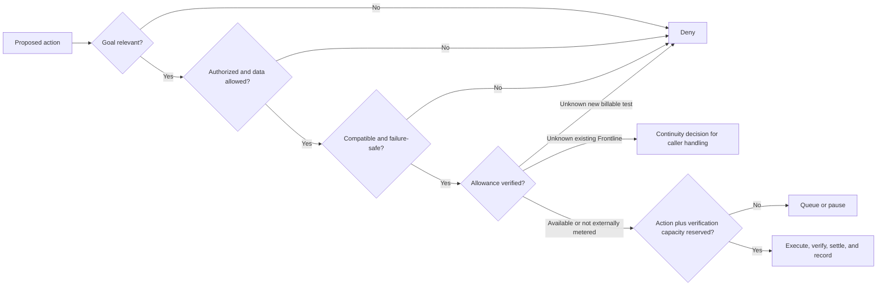

# Software Passports and admission control

This is the first enforceable part of the Software-Aware Operation Policy. It
does not claim that every account allowance or every failure mode has been
verified.

## What changed

`config/software-passports.v1.json` records ten material dependencies:
Railway, GitHub, Supabase, LINE, Gemini, LangSmith, Ollama, Codex, OpenAI API,
and the separate OpenRouter public-test route. Codex and OpenAI API have
separate records because their usage and billing are separate.

Each passport covers:

1. purpose and ownership;
2. plan and billing;
3. capacity;
4. execution contract;
5. data conditions;
6. permissions;
7. terms and licensing; and
8. recovery and change.

Every evidence item has a date, source, and one of these statuses:

- `unresolved`
- `published_rule`
- `account_verified_setting`
- `behavior_tested`
- `accepted_for_workflow`
- `not_applicable`

A published limit does not become an account balance. A configured setting
does not become a tested behavior. A tested behavior does not become accepted
for every workflow.

## Personal verification fields

The following values remain `null` where the repository has no current private
account evidence:

- account and workspace owner;
- exact plan or tier;
- remaining credits, requests, messages, minutes, tokens, or traces;
- reset or expiry time;
- payment method, overage, alert, and hard-stop settings.

Do not put names, email addresses, keys, access tokens, signed links, card
details, full LINE identifiers, or private customer content in this Git-tracked
file. A future private snapshot may store opaque evidence references and
hashes, but never the credentials themselves.

## Admission decision

The deterministic controller checks seven facts before it reserves capacity:



The action and the resources needed to verify it are reserved together. The
test-only capacity store is atomic within one Node.js process and proves the
decision rules. A staged Supabase migration now implements the durable version
as one transaction: it locks every named pool in stable order, reserves the
action and verification bundles together, and writes the audit record before
commit. Isolated PostgreSQL tests cover last-budget contention, rollback when
audit fails, unknown versus verified-zero allowance, dispatch, cancellation,
uncertain transport, settlement, expiry reconciliation, and browser denial.
An action or verification side may be empty only when the exact passport cost
model says it consumes no separate unit; the combined metered bundle may never
be empty. Verified snapshots stop authorizing new work after their recorded
reset/expiry time. Every reservation captures the pool's allowance epoch, so a
late cancellation or reconciliation cannot refund an old period into a newly
verified period. A lease cannot cross a known reset, dispatch rechecks both the
epoch and snapshot expiry, and the database refuses an epoch refresh while any
dispatched use from that epoch remains unresolved. The service role has
read-only ledger access and can mutate state only through the fixed-search-path
transition RPCs. Creating or refreshing verified allowance snapshots remains a
private founder/database-owner procedure; no runtime RPC can invent them.

The migration is **not applied to the live Supabase project**. Its test uses
PGlite rather than concurrent live Supabase connections, so it is development
evidence rather than a production capacity guarantee.

Actor, data class, workload, workflow, and goal relevance must come from an
authenticated server policy context in production. The two bounded synthetic
CLIs instead use fixed, internal contexts defined in their source. A model or
end-user request cannot supply those facts. Reservation amounts come from the
versioned passport operation, and each decision records the register version,
service, and passport digest.

The controller returns a continuity decision only. A production caller must
implement and verify the safe degraded reply and founder alert; those handlers
are not connected in this milestone.

An uncertain failure after dispatch is not refunded automatically. It stays in
reconciliation state, because the external service may already have consumed
the request or completed the action.

## Controls active now

- `npm run check` rejects a structurally invalid passport register and reports
  material-field coverage separately.
- The OpenRouter synthetic-model CLI makes no provider request while its
  private allowance is unknown.
- Explicit LangSmith trace commands make no upload while the private trace
  allowance is unknown.
- Local Ollama synthetic work remains admitted because it has no external
  model API meter; laptop resources and electricity are still real costs and
  remain unmeasured.
- Credential-like values and signed URLs are rejected from the register.
- Trace redaction removes credential fields, signed URLs, activation codes,
  and LINE identifiers in deterministic tests.
- A production admission factory now uses a closed action catalog, a
  server-owned authority resolver, tenant/resource scope, a durable-store
  readiness check, and audited early denials. Its Supabase adapter matches the
  staged multi-pool RPC contract.
- `SOFTWARE_ADMISSION_ENABLED=false` is the only supported deployed setting for
  this milestone. In this mode the model seam preserves existing behavior and
  does not load passports, reserve capacity, resolve authority, or write an
  admission audit. If the flag is enabled before the missing dependencies are
  supplied, model dispatch stops before an external request.

The production server contains the disabled model-dispatch seam, but live
LINE/Gemini admission is not enabled. Tool calls, database writes, LINE replies
and pushes are not yet connected to the new controller. This is deliberate:
the passport reports several unknown account allowances, no production
workflow is founder-accepted, and the policy forbids silently shutting down an
existing customer path merely to make a budget claim.

## Current result

Run:

```powershell
npm run passport:check
```

The register is structurally valid and has a record for all ten known material
dependencies. Detailed coverage is still `partial`: some material subfields
and claim-level evidence links required by the full policy have not yet been
modeled. Nine external services still report an unknown account allowance.
That is a correct unresolved result, not a zero balance and not permission to
spend. No passport revision is marked founder-accepted for a workflow yet;
that status requires your review of the exact revision.

## Required next evidence

The founder must privately verify these dashboard-only values before a new
billable test is admitted:

| Service | Private facts still required |
| --- | --- |
| Railway | actual plan, remaining credit, reset/expiry, alert and hard-stop behavior |
| GitHub | actual plan and any metered Actions or artifact usage relevant to the release path |
| Supabase | current database/storage/egress use and applicable exhaustion behavior |
| LINE | Thailand OA plan, monthly message target, current sent count, and additional-message setting |
| Gemini | project tier plus current model RPM, TPM, RPD, and billing link state |
| LangSmith | plan, remaining base traces, reset, payment method, overage, and retention settings |
| Codex | plan-specific remaining usage and reset time, if shown |
| OpenAI API | current usable credit, approved model, hard limit, and production authorization |
| OpenRouter | usable free allowance, reset, and payment/overage state for the synthetic route |

Leave any unavailable value `null` and keep the corresponding status
`unresolved`. Never infer it from a successful key, a published plan, or a
previous invoice.

## Next implementation milestone

1. Independently review the staged migration and adapter, then test the RPCs on
   an isolated Supabase branch or disposable project; do not apply them to the
   live project first.
2. Add the server-owned authority resolver and durable early-denial audit
   writer, then thread stable action keys and lifecycle settlement through the
   model seam.
3. Add explicit admission points for scoped tools, database writes, LINE reply
   and push operations, including a tested static continuity reply and founder
   alert.
4. Privately verify the relevant account allowance and keep unknown values
   `null`. Bind founder acceptance to the exact passport revision and commit.
5. Enable one read-only founder workflow on the inactive test path, verify it,
   and only then consider a controlled Frontline release.

This keeps the order: reproduce, patch, isolate, review, approve, release, and
verify. It does not deploy a repair or alter production authority automatically.
